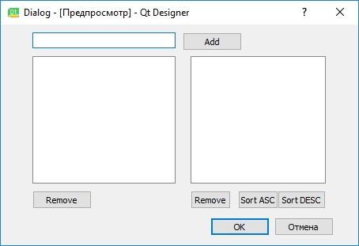

# Dialog

Сделать программу, которая будет выглядеть как на скриншоте ниже. На форме должно быть 2 контрола для отображения списка. По нажатию на Add в контролы нужно добавить текст, что введён в LineEdit'е, оба контрола должны обновиться (должен отобразиться новый элемент). Левый контрол должна показывать данные как есть, в порядке их добавления. Во втором контроле данные должны показываться отсортированными. Кнопками Sort XXX должен меняться порядок сортировки. По нажатию на Remove, должен удалиться выделенный элемент, второй контрол должна также правильно обновиться.
Сделать нужно на Qt/Widgets (не на QML).
Плюсом будет, если сделаете, чтобы при выделении элемента в любом контроле автоматически выделялся этот же элемент в другом.

