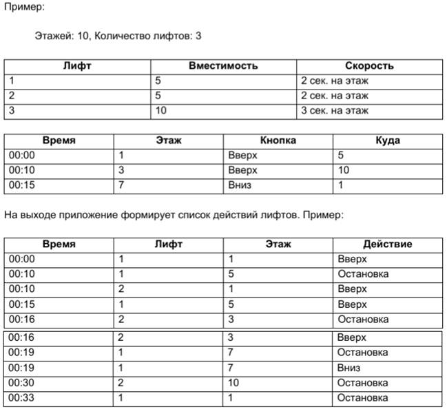

# Elevator

Разработать приложение на С++ которое реализует программу управления лифтами в доме.

Приложение на вход получает следующие данные:

1. Количество этажей в доме.
2. Количество лифтов. Для каждого лифта указывается его вместимость и скорость.
3. Список событий вызова лифта.

Опциональные варианты усложнения:
* Каждый лифт движется в своем потоке
* Лифт в процессе движения может подбирать пассажиров в свою сторону движения
* При отсутствии вызовов в течении N секунд – лифт возвращается на 1-ый этаж.
